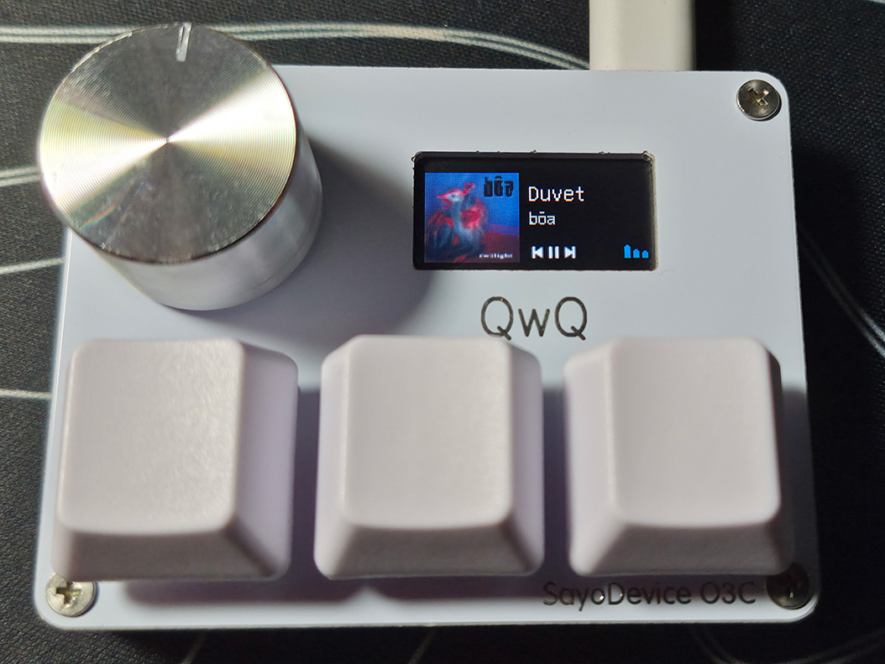

# SayoMedia

  
  

**Transform your SayoDevice into a media controller!**

SayoMedia streams a live "now playing" screen to your SayoDevice's
display: cover art, track title, artist, play/pause status from
whatever is playing on your system.

> [!NOTE]
> For now, SayoMedia is **Windows-only**.

## What it does

- 🎵 **Now playing display** - cover art, title, artist, play/pause/skip
icons and a little equalizer.
- 🌍 **Full UTF-8 support** - titles and artists in any language 
should render correctly.
- ↔️ **Auto-scrolling text** - if a title or artist is too long to
fit, it smoothly scrolls back and forth.
- 💤 **Sleeps automatically** - when nothing is playing the screen 
goes back to your chosen content.

## Requirements

> [!IMPORTANT]
> **You MUST enable the 8000 Hz USB connection speed** in your 
> device's settings at [sayodevice.com](https://sayodevice.com).
> SayoMedia talks to the high-speed v2 HID interface, which only 
> appears when 8000Hz polling is enabled. Without it the program 
> simply will not display anything on your screen!

> [!WARNING]
> **This program will NOT properly work on the newest SayoDevice 
> firmware versions.** You
> specifically need firmware **v0.1.\***. See
> [Downgrading the firmware](#downgrading-the-firmware) below.

## Downgrading the firmware

If you're on a newer firmware, downgrade to a v0.1.\* build like this:

1. Download and unpack the latest official firmware update tool:
   [CH32X035_firmware_1.2.30.zip](https://tc1.sayobot.cn:25225/firmware/CH32X035_firmware_1.2.30.zip)
2. Replace the `config.json` file and the `./firmware/` folder inside it with the ones from here: [firmware/old/5/](https://tc1.sayobot.cn:25225/firmware/old/5/)
3. Run the `upgrade -r.bat` file and wait until it finishes its job.

If the `.bat` file says `waiting for device...` forever, try
copying the `config.json` and `./firmware/` from one of the other 
folders in this directory instead:
[firmware/old/](https://tc1.sayobot.cn:25225/firmware/old/)

If nothing works, try using this update tool instead:
[CH55X_firmware_1.2.22.zip](https://tc1.sayobot.cn:25225/firmware/CH55X_firmware_1.2.22.zip)

## Launch on startup

To make SayoMedia start automatically when you log in, place
[scripts/add-to-autorun.bat](scripts/add-to-autorun.bat) next to `SayoMedia.exe` and run it.

## Building

You need the **MSVC** compiler to build this program. To compile it, just run the `build.bat` file in the *Developer Command Prompt*.

The output `.exe` file is located in the `/build/` folder.

## How it works

- **Display** - talks to the SayoDevice over its high-speed v2 HID 
interface (VID `0x8089`, PID `0x0009`, usage page `0xFF12`), 
querying the screen size and streaming a full RGB565 framebuffer
in 1024-byte chunks.
- **Media** - [src/media.cpp](src/media.cpp) wraps the WinRT
`GlobalSystemMediaTransportControlsSessionManager` to poll the 
current Windows "now playing" session for title, artist, playback 
state and cover art.
- **Rendering** - [src/main.c](src/main.c) draws the cover art, 
GNU Unifont text (with scrolling), playback icons and the 
equalizer into the framebuffer at ~30 FPS.
